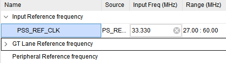

# AXI4-Stream Custom IP On-Board Validation (Zynq UltraScale+ MPSoC)

**Path:** `README.md`  
**Board:** ZCU102 (Zynq UltraScale+ MPSoC)  
**Vivado/Vitis Version:** 2023.1

## 📂 Repository Structure
```
AXIS_CustomIP_OnBoard_Verification/
│── AXIS_CustomIP_DDR_Test/ #the project folder that includes the block design
│── DDR_workspace/ #Vitis firmware source folder: contains `frame1.h`, `frame2.h`, `main.c`
│── platform_files/ #*.xsa
└── AXIS_CustomIP_DDR_Test_BlockDesign.pdf/
```

---

## 1. Goal
Validate the **DDR → DMA (MM2S) → Custom AXI4-Stream IP → DMA (S2MM) → DDR** pipeline on **Zynq UltraScale+ MPSoC** boards using predefined input frames from **`frame1.h`** and **`frame2.h`**.  

The validation process **must include an Integrated Logic Analyzer (ILA) in the block design**, configured to trigger on **EOF (end-of-frame) signals**. Hardware-captured results are then compared with the DDR output buffer to ensure end-to-end data integrity.  

This guide covers **block design setup (with HP port configuration and clocking)**, **address/parameter configuration**, **Vitis firmware build and execution**, **cache handling and transfer order**, and a **debugging checklist**.

---

## 2. System Overview
```
    ┌───────────────────────────────┐
    │           DDR (Input)         │
    │   frame1.h / frame2.h data    │
    └───────────────────────────────┘
                    │
                    ▼
              MM2S (DMA Read)
                    │
                    ▼
           AXI4-Stream Interface
                    │
                    ▼
    ┌───────────────────────────────┐
    │         Custom AXI IP         │
    │   (process stream data here)  │
    └───────────────────────────────┘
                    │
                    ▼
           AXI4-Stream Interface
                    │
                    ▼
              S2MM (DMA Write)
                    │
                    ▼
    ┌───────────────────────────────┐
    │           DDR (Output)        │
    │        rx_buffer storage      │
    └───────────────────────────────┘
```

- **MM2S**: Sends frame data (`frame1_data`, `frame2_data`) from DDR as AXI-Stream source  
- **Custom IP**: AXI4-Stream **Slave In** / **Master Out**  
- **S2MM**: Stores IP output stream into DDR (`rx_buffer`)  

### Source Files
- **Input headers**: `src/frame1.h`, `src/frame2.h`  
- **Main firmware**: `src/main.c`  
- **Python script (auto-generate frame1.h)**: `scripts/gen_frame1_header.py` 


> Example uses **polling mode (Simple Mode)** without interrupts (can be extended if needed).

---

## 3. Data Specification Example
- Input frame resolution: `IN_WIDTH=320`, `IN_HEIGHT=180`, `INPUT_CHANNEL=16` ⇒ `IN_FRAME_BYTES = 921,600B`  
- Output frame resolution: `OUT_WIDTH=1280`, `OUT_HEIGHT=720`, `OUTPUT_CHANNEL=1` ⇒ `OUT_FRAME_BYTES = 921,600B`  
- Input and output sizes match (921,600B) for convenience  
- Buffer alignment: `__attribute__((aligned(64)))`  

> **Note**: The `TDATA` width of the IP must match the DMA stream width. If not, use `AXIS Data Width Converter` / `AXIS Subset Converter`.

---

## 4. Vivado Block Design Steps (Zynq UltraScale+ MPSoC)

1. **Processing System (zynq_ultra_ps_e)**  
   - Enable DDR and one or more **High-Performance (HP) ports** or **High-Performance Coherent (HPC) ports** for DMA access to DDR.  
   - Typical: connect AXI DMA to `S_AXI_HP0_FPD` or another HP port.  

2. **AXI DMA (Simple Mode)**  
   - Disable Scatter-Gather  
   - Configure **Stream Data Width** to match the IP’s `TDATA` width (e.g., 32b, 64b, 128b)  
   - Set **Buffer Length** according to the expected frame size (must cover `IN_FRAME_BYTES` and `OUT_FRAME_BYTES`)  
   - Enable both **MM2S** and **S2MM** stream ports  

3. **Custom AXI4-Stream IP**  
   - Slave (s_axis) ← MM2S  
   - Master (m_axis) → S2MM  
   - Insert converters if data width mismatch occurs  

4. **Clock/Reset**  
   - **PS Reference Clock**:  
     - Set `PSS_REF_CLK = 33.330 MHz` (valid range 27–60 MHz)  
     - *Path*: PS → Clock Configuration → Input Reference Frequency  
   - Ensure reset polarity consistency across the stream domain  

   

---

## 5. IP Packaging — Clock Metadata Warning

> ⚠️ **Critical Warning Prevention**  
> - When packaging a custom IP, in *Ports and Interfaces* → Clock interface metadata:  
>   - **Define only the `FREQ_HZ` key**, but **do not assign a fixed VALUE** (e.g., `300000000`).  
> - Hardcoding the value can cause a **Critical Warning** in Block Design if it conflicts with PS-generated `pl_clk0=299.xxx MHz`.  
> - Correct practice: leave VALUE empty so that the **frequency is propagated automatically from the connected PS clock source**.  

---

## 6. Vitis Project Setup
- **BSP**: Standalone
- **Sources**: `main.c`, `frame1.h`, `frame2.h`, `platform.c/h`  
- **Linker script**: ensure `rx_buffer` and frame data are placed in DDR  
- **Platform note**: UltraScale+ requires FSBL and PMUFW to be generated with the platform  

### 6.1 Cache & Transfer Rules
- **MM2S source**: Flush cache before DMA transfer (`Xil_DCacheFlushRange`)  
- **S2MM destination**: Invalidate cache after DMA completes (`Xil_DCacheInvalidateRange`)  
- **Order**: Always start **S2MM first**, then **MM2S**  

### 6.2 Build & Run
1. Build application (Release recommended)  
2. Program device with bitstream (via JTAG)  
3. Monitor UART console (115200 8N1)  

---

## 7. Expected UART Log (Example)
```
DMA initialization success..
Starting in:
20 sec
Status before data transfer: 0x0
=== FRAME 1 START ===
Waiting for FRAME 1 DMA completion...
MM2S Busy? 0 S2MM Busy? 0
=== FRAME 1 RX DATA ===
[0] received: 0x..
...
[921599] received: 0x..
=== FRAME 2 START ===
Waiting for FRAME 2 DMA completion...
MM2S Busy? 0 S2MM Busy? 0
=== FRAME 2 RX DATA ===
[0] received: 0x..
...
[921599] received: 0x..
=== ALL FRAMES DONE ===
```

---

## 8. Debugging Checklist
- **Busy stuck at 1**: Check tvalid/tready handshake, clock/reset domains  
- **Corrupted/zero data**: Verify cache flush/invalidate ranges, alignment  
- **Width mismatch**: Insert AXIS DWC if necessary  
- **Start S2MM first** to avoid data loss  

---
