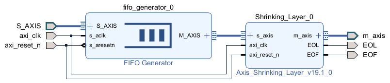

# AXI4-Stream Custom IP Functional Verification

This repository contains a **functional verification environment** for a custom AXI4-Stream IP.  
The setup guarantees AXI4-Stream compliance by inserting an **AXIS FIFO** in front of the custom IP inside a Block Design (BD).  
The BD HDL wrapper is then used as the **DUT** in the testbench.  
Verification is based on **feeding input data from text files** and **checking the DUT output via waveforms or log files**.

---

## 1. Data Width Calculation

For convolution layers, the **AXIS data width** is determined as:
```
Data Width = (Number of Channels) × (Bits per Channel)
```

- Each channel = **8 bits**  
- Example:  
  - Input = 16 channels → `16 × 8 = 128-bit`  
  - Output = 12 channels → `12 × 8 = 96-bit`

---

## 2. Directory Structure

```
AXIS_FIFO_CustomIP_Func_Verification/
│
├─ AXIS_FIFO_CustomIP_Func_Verification.srcs/
│ ├─ sim_1/new/
│ │ └─ tb_Shrinking_Layer_Test_wrapper.v # Testbench code
│ │
│ ├─ input_datas_1/ # Input stimulus data files (.txt, hex format)
│ │ └─ layer1_first_output_hex_rearranged.txt
│ │
│ └─ weight_datas_1/ # Weight data (if required by BD custom IP)
│ └─ <weight text files>
│
└─ README.md
```

- **Testbench Path**:  
  `AXIS_FIFO_CustomIP_Func_Verification/AXIS_FIFO_CustomIP_Func_Verification.srcs/sim_1/new/tb_Shrinking_Layer_Test_wrapper.v`

- **Input Data Path**:  
  `AXIS_FIFO_CustomIP_Func_Verification/AXIS_FIFO_CustomIP_Func_Verification.srcs/input_datas_1/`

- **Weight Data Path** (when required by the BD custom IP):  
  `AXIS_FIFO_CustomIP_Func_Verification/AXIS_FIFO_CustomIP_Func_Verification.srcs/weight_datas_1/`

---

## 3. Input Stimulus File Format

- **One line = One AXIS beat**  
- Each line contains **HEX characters** representing the full data width  
- Example (128-bit input, 32 hex chars per line):

```
00000612131500130B19110000000000
00000B11191200190819000000000000
00000B121B13001B0A1B000000000000
...
```

- File rules:
  - No `0x`, commas, or comments inside the file  
  - End-of-line (newline) included on the last line  
  - MSB on the **left**, LSB on the **right**  

---

## 4. Using Weight Data

When the custom IP requires **weight data files**:

- Place them under:  
  `AXIS_FIFO_CustomIP_Func_Verification/AXIS_FIFO_CustomIP_Func_Verification.srcs/weight_datas_1/`

- In the BD, configure the custom IP to load weights from this directory  
- File format is the same principle (hex per line), but the **width = (number of weights per beat) × 8 bits**  

---

## 5. Block Design Overview

Below is the Block Design structure where the **AXIS FIFO** is inserted in front of the custom IP to ensure valid AXIS input signals.  




---

## 6. Output Monitoring

The testbench monitors output beats and logs them:
```
[RX 1] Output = <output channel*1byte-bit data>
```

Optionally, you can redirect outputs to a file (`out_dump.hex`) for comparison with a golden file.

---

## 7. Checklist

- [ ] Input file width = (channels × 8 bits)  
- [ ] Input file placed in `input_datas_1/`  
- [ ] Weight file (if needed) placed in `weight_datas_1/` and connected to the BD IP  
- [ ] File formatting correct (HEX only, no 0x/comma)  
- [ ] AXI4-Stream handshake verified (`tvalid & tready`)  
- [ ] Waveform/log inspected for correctness  

---

## 8. Conclusion

This environment enables **functional verification of AXI4-Stream compliance** by:
- Using text-based input stimulus files  
- Optionally supplying weight data to the BD custom IP  
- Monitoring DUT output under backpressure conditions  
- Confirming correctness via logs and waveform inspection
