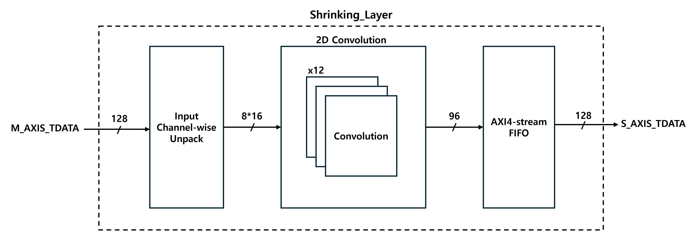

# AXIS_FSRCNN_Layers_CustomIPs

## 📌 Overview
This repository provides a collection of **AXI4-Stream based custom IP cores** designed for the **pre/post-processing stages of FSRCNN (Fast Super-Resolution Convolutional Neural Network)**.  
The implemented IPs are:

- **Y Converter**: Converts 32-bit **XBGR8888** input into a single luminance channel (Y)  
- **Shrinking Layer**: Reduces feature map dimensionality (16 → 12 channels)  
- **Expanding Layer**: Expands reduced feature maps back to higher dimensionality (12 → 16 channels)  

All modules are implemented in **Verilog HDL**, interfaced through **AXI4-Stream**, and verified using **functional simulation, UART logging, and ILA on-board validation**.  
Target platform: **AMD Xilinx ZCU102 (UltraScale+ MPSoC)**, Vivado 2023.1.

---

## 📂 Repository Structure
```
AXIS_FSRCNN_Layers_CustomIPs/
│── reference_code/                    # FSRCNN reference C code (Light-weighted, Quantized)
│── AXIS_Y_Converter/                  # Custom IP core for Y-channel extraction (XBGR8888 → Y), incl. RTL & packaged IP
│── AXIS_Shrinking_Layer/              # Shrinking Layer IP core (16ch → 12ch), with RTL sources and packaged IP
│── AXIS_Expanding_Layer/              # Expanding Layer IP core (12ch → 16ch), with RTL sources, testbenches, and simulation setup
│── AXIS_FIFO_CustomIP_Func_Verification/ # Functional verification resources (block diagrams, design notes, behavioral test files)
│── AXIS_CustomIP_OnBoard_Verification/   # On-board validation resources (ILA captures, UART logs, synthesis/implementation reports)
└── AXIS_IPs_v19.1_for_Integration.zip    # Pre-packaged IP bundle for users running Vivado versions earlier than 23.1
```

---

## 🛠️ IP Descriptions
### 🔹 Y Converter
- **Input**: 32-bit AXI4-Stream (XBGR8888: padding + Blue + Green + Red)  
- **Output**: 8-bit AXI4-Stream (Y channel)  
- **Purpose**: Provides luminance-only data for FSRCNN input  

### 🔹 Shrinking Layer
- **Input**: 128-bit AXI4-Stream (16 channels × 8-bit)  
- **Computation**: Produces 96-bit result (12 channels × 8-bit)  
- **Post-Processing**: Due to byte-based alignment in AXI4-Stream FIFO (back buffer), the 96-bit result is **zero-padded to 128-bit** before transmission  
- **Purpose**: Reduces channel dimensionality to lower computational load while maintaining AXI4-Stream byte alignment  

### 🔹 Expanding Layer
- **Input**: 96-bit AXI4-Stream (12 channels × 8-bit)  
- **Output**: 128-bit AXI4-Stream (16 channels × 8-bit)  
- **Purpose**: Recovers feature dimension to 16 channels, restoring representational capacity before the reconstruction stage  

---

## 🖼️ Architecture

### 1) Shrinking Layer — Top-Level Block Diagram


**Key Points**
- Output channel-wise parallelism is adopted  
  → Enables the next layer to receive concatenated input channels in one clock cycle when performing 1-size kernel convolution.  
- Input data from the master is consistently formatted as `{ch16, ch15, … , ch1}`.  
  → An unpacking stage distributes the data to 12 parallel convolution modules.  
- An AXI4-Stream FIFO is used as a back buffer.  
  → Overflow is prevented by monitoring the FIFO **TREADY** and **almost_full** signals to control the Shrinking Layer’s master ready signal.  
- The convolution modules follow a **weight-stationary architecture**: weights are preloaded and fixed in on-chip registers/ROM (Weight_RF), while activations are streamed through, minimizing external memory bandwidth.  

---

### 2) Output Channel-wise Convolution — Detailed Block


**Key Points**
- Convolution multiplications use DSP-based multipliers.  
- Quantization avoids DSP usage by applying a **2-stage pipelined multiplier** (non-DSP)  
  → Conserves DSP resources and meets 300 MHz clock timing (slack management).  
- The block diagram illustrates computation for **one output channel**.  
  → In the Shrinking Layer, 16 input channels are compressed into 12 output channels, so this block is instantiated **12 times in parallel**.  
- Each convolution block is based on a **weight-stationary dataflow**:  
  - The weights for each output channel are held constant in local registers.  
  - Only the input feature maps are streamed in, reducing data movement and ensuring efficient reuse of weights.  

---

### 3) Expanding Layer
- Architecturally identical to the Shrinking Layer, except for reversed channel dimensions.  
  - **Input**: 12 channels → **Output**: 16 channels  
- Maintains output channel-wise parallelism, AXI4-Stream FIFO backpressure control, and **weight-stationary convolution structure**.  

---

## 🧪 Verification
- **Testbenches (TB)**: Deterministic input/output verification for each IP  
- **Functional Simulation**: Conducted in Vivado simulator for correctness check  
- **UART Logging**: Captured runtime outputs for validation  
- **ILA Probing**: On-board validation of timing, handshake, and data integrity  

---

✅ Additional Verification
SystemVerilog-based verification has also been completed in collaboration with a teammate.  
For details, please refer to the following repository:  
**신광선(Gwangsun Shin, youngyang00)**
👉 [Teammate’s GitHub Repository](https://github.com/youngyang00/SystemVerilog-AXI4S-ImageVerify)

---

## 📊 Performance Summary (ZCU102, Vivado 2023.1)

### 🔹 Y Converter
**Timing Summary**
| Metric | Value |
|--------|-------|
| Worst Negative Slack (WNS) | **0.267 ns** |
| Worst Hold Slack (WHS)     | **0.095 ns** |
| Worst Pulse Width Slack (WPWS) | **0.416 ns** |
| Note | All constraints met |

**Resource Utilization**
| Resource | Utilization | Available | Utilization % |
|----------|-------------|-----------|---------------|
| LUT      | 121         | 53,200    | 0.23 % |
| LUTRAM   | 6           | 17,400    | 0.03 % |
| FF       | 207         | 106,400   | 0.19 % |
| IO       | 40          | 125       | 32.00 % |

---

### 🔹 Shrinking Layer
**Timing Summary**
| Metric | Value |
|--------|-------|
| Worst Negative Slack (WNS) | **0.762 ns** |
| Worst Hold Slack (WHS)     | **0.008 ns** |
| Worst Pulse Width Slack (WPWS) | **1.124 ns** |
| Note | All constraints met |

**Resource Utilization**
| Resource | Utilization | Available | Utilization % |
|----------|-------------|-----------|---------------|
| LUT      | 4761        | 274,080   | 1.74 % |
| LUTRAM   | 1           | 144,000   | 0.00 % |
| FF       | 3999        | 548,160   | 0.73 % |
| BRAM     | 3           | 912       | 0.33 % |
| DSP      | 192         | 2520      | 7.62 % |
| IO       | 232         | 328       | 70.73 % |
| BUFG     | 1           | 404       | 0.25 % |

---

### 🔹 Expanding Layer
**Timing Summary**
| Metric | Value |
|--------|-------|
| Worst Negative Slack (WNS) | **0.593 ns** |
| Worst Hold Slack (WHS)     | **0.005 ns** |
| Worst Pulse Width Slack (WPWS) | **1.124 ns** |
| Note | All constraints met |

**Resource Utilization**
| Resource | Utilization | Available | Utilization % |
|----------|-------------|-----------|---------------|
| LUT      | 3885        | 274,080   | 1.42 % |
| LUTRAM   | 1           | 144,000   | 0.00 % |
| FF       | 2844        | 548,160   | 0.52 % |
| BRAM     | 4           | 912       | 0.44 % |
| DSP      | 192         | 2520      | 7.62 % |
| IO       | 232         | 328       | 70.73 % |
| BUFG     | 1           | 404       | 0.25 % |

---

